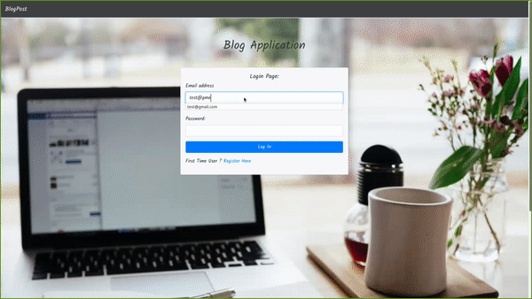
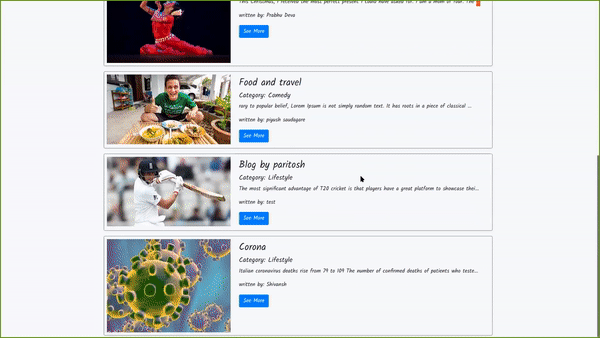
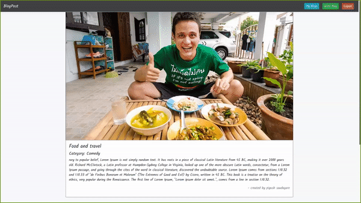

##  Project Name: BlogPost

Project Description:

In 'BlogPost' User is able to register himself and login and with each request in blog-post user authentication check is made to check registration authenticity of user.

Each User able to see blog posted by all active users and can read each blog in detail alongwith comments associated with blog.

Logged In user is able to comment on any blog and able to perform deletion and updation on his/her blog, But not allowed to alter comments made by other users.

User specific features:
- Able to see his own blog-list,
- update and delete his own blog-list,
- write new blog.

Project Stack: HTML,CSS,JS,Bootstrap,React,Redux,Python,Flask,Mysql,JWT-Authentication

